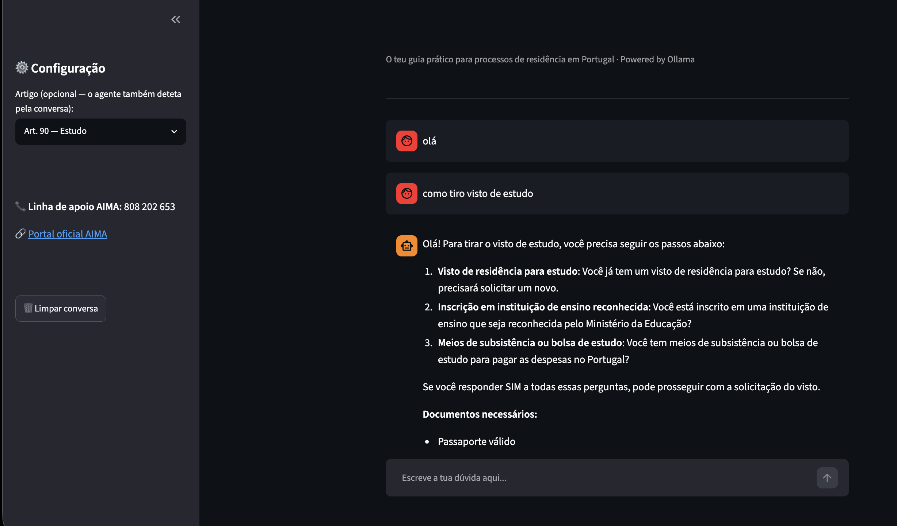

# Pitch

---

## Roteiro

### 1. O Problema 

Portugal recebe milhares de imigrantes por ano — mas o sistema de imigração é um labirinto.
Com a extinção do SEF e a criação da AIMA, os portais mudaram, os prazos foram alterados por Decreto-Lei e a informação está dispersa por dezenas de fontes diferentes. O resultado? Imigrantes que submetem documentos errados, perdem agendamentos e, em alguns casos, entram em situação irregular sem perceber que o seu título tinha sido prorrogado automaticamente.

---

### 2. A Solução 

O **Descomplica AIMA** é um assistente de IA local que funciona como um "tuga experiente" sempre disponível. Em vez de obrigar o utilizador a ler PDFs de legislação ou a depender de fóruns desatualizados, o agente:

- **Identifica o artigo correto** para cada situação (trabalho, estudo, família) através de perguntas de triagem simples;
- **Gera checklists personalizadas** com os documentos obrigatórios para cada processo, retiradas diretamente dos ficheiros de dados locais (`checklists_docs.csv`, `procedimentos_aima.json`);
- **Valida prazos e prorrogações** com base no Decreto-Lei n.º 85-B/2025, evitando que o utilizador entre em situação irregular por desconhecimento;
- **Informa as taxas atualizadas** (Portaria n.º 204/2024) antes de qualquer submissão;
- **Nunca inventa informações** — se o caso for uma exceção não mapeada, admite a limitação e sugere apoio jurídico.

A solução corre localmente com **Ollama + Streamlit**, sem enviar dados pessoais para a cloud.

---

### 3. Diferencial e Impacto

A maioria dos chatbots de imigração baseia-se em informações genéricas ou em RAG sobre documentos desatualizados. O **Descomplica AIMA** diferencia-se por:

- **Dados estruturados e verificáveis** — qualquer resposta sobre documentos ou taxas tem origem num ficheiro local auditável;
- **Rodar 100% offline** — privacidade garantida, sem dependência de APIs pagas;
- **Design anti-alucinação por arquitetura** — o LLM nunca responde sem contexto injetado da base de conhecimento.

O impacto social é direto: menos processos indeferidos por erro, menos imigrantes em situação irregular por desinformação e mais autonomia para quem mais precisa de clareza num momento de vida já de si complexo.

---
### 4. Tela de Demonstração

1. Abertura da interface Streamlit no browser (`localhost:8501`);
2. Utilizador escreve: *"como tiro visto de estudo"*;
3. O agente faz triagem e identifica o Artigo 90.º;
4. Resposta com checklist completa de documentos, portal correto e taxa de 155€.

---

### 5. Apresentação em PDF

### 6. Link do Vídeo

[\[Link do vídeo\]](https://app.screencastify.com/watch/aI6yPbX4cf4NXxeHsnNw)
